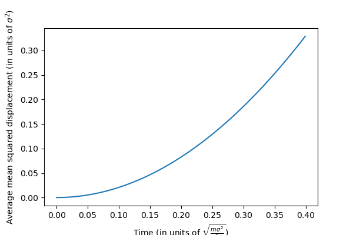

# Weekly progress journal

## Instructions

In this journal you will document your progress of the project, making use of the weekly milestones.

Every week you should 

1. write down **on the day of the lecture** a short plan (bullet list is sufficient) of how you want to 
   reach the weekly milestones. Think about how to distribute work in the group, 
   what pieces of code functionality need to be implemented.
2. write about your progress **until Sunday, 23:59** before the next lecture with respect to the milestones.
   Substantiate your progress with links to code, pictures or test results. Reflect on the
   relation to your original plan.

We will give feedback on your progress on Tuesday before the following lecture. Consult the 
[grading scheme](https://computationalphysics.quantumtinkerer.tudelft.nl/proj1-moldyn-grading/) 
for details how the journal enters your grade.

Note that the file format of the journal is *markdown*. This is a flexible and easy method of 
converting text to HTML. 
Documentation of the syntax of markdown can be found 
[here](https://docs.gitlab.com/ee/user/markdown.html#gfm-extends-standard-markdown). 
You will find how to include [links](https://docs.gitlab.com/ee/user/markdown.html#links) and 
[images](https://docs.gitlab.com/ee/user/markdown.html#images) particularly
useful.

## Week 1
10/02 and 11/02: 
Branch 'testing' created because no permission to edit master branch.
1) Lennard Johnes function for calculating the potential between a pair of molecules created. Two versions created, one with handling errors and exceptions and one without (version for reading fast what's going on in the code)
2) file main_module created, contains constructors of class Molecule (describing a single molecule/atom) and Gas describing collection of instances of Molecule class. Methods added to the classes, eg to obtain position, velocity of molecules and forces experienced due to Lennard Johnes potential
3) simulation.py file created. This is the simulation where we create molecules and enviroment (eg can specify temperature, pressure etc). Other files are imported and used by this one and run 'behind the scenes'.
11/02-13/02:
1) code expanded to support 2D
2) time evolution of the system added
3) periodic boundary conditions added
4) calculation of total energy, potential energy and kinetic energy and check of conservation of energy added
5) function added to generate simulation with stated: number of molecules, temperature, pressure, box dimensions, dimension of the simulation (1D or 2D) (the velocities and positions are distributed according to Gaussian distribution) - this can be used to initialize the simulation

outcomes:
the code supports 2D and 1D
you can adjust temperature, pressure and dimensions of the gas box
you can turn periodic boundary conditions on and off (wouldn't recomend turning off because then the meaning of the simulation is unknown)
you can evolve the system in time with chosen number of steps and chosen size of the timestep
you can check if the total energy is conserved
the code supports any number of gas molecules with any initial energy and position, not recomended to use more than 4 molecules because then it's slow

(due 14 February 2021, 23:59)

## Week 2
(due 21 February 2021, 23:59)
1) correction of the periodic boundary conditions, now it keeps going until the molecules are confined within the box, beofre it only did correction once but molecule could still be left outside of the box.
2) correction of function that generates randomly distributed velocities of molecules at given temperature
3) energy of the system isnt's conserved because the velocities only keep increasing. don't know how to correct for that yet.
4) as suggested by the TA the code was enchanced to benefit from the speedups provided by numpy
5) code expanded to 3D
6) the periodic boundary conditions work in a sense that once a molecule passes the boundary of the box it reapears on the other side with the same velocity as it would have if it continued outside of the box.

## Week 3

1) The code was extended to more than 2 particles. However, when we run the code for more than 8 particles, enery isn't conserved anymore. This could be because the timesteps are too large, or the simulation box could be too small. There also seems too be a problem in conservation of energy when particles come too close. In the Figure below you can see the simulation for 8 particles. The energy seems to be (approximately) conserved. Where there are peaks (meaning particles come close) a slight increase can be seen. 

2) Verlet and Euler method are both implemented and work, the difference in energy conservation is visable.
In the Figure below you can see the simulation using the Euler method, and you can see that the total energy increases over time. 

However, when we use the Verlet method, the total energy barely increases. The increases you see can be explained by the point we discussed before. You can definitely see that the Verlet method work better than the Euler method.

3) The code has been reorganized, it has been split into two files: skeleton_ours.py which runs 'behind the scenes' and simulation.py which is the file where the simulation happens. Run simulation.py as a python notebook to simulate the gas under chosen conditions.

## Week 4
1) Added a function that can make an FCC lattice for a given amount of particles, box size and number of dimensions. It can also fill up the FCC lattice completely by adding extra particles.

2) Added a function calculates the individual MSD's and the average MSD of all particles. Periodic boundary conditions were considered. For a very high density of particles where the interactions are relevant we can see linear behaviour of the average MSD. (Here the parameters are: dim = 3, num_tsteps = 1000, num_atoms = 500, box_dim = 10, temp=100 and timestep = 0.0004)

3) The MSD calculation also shows parabollic behaviour for lower densities and smaller forces. Here the MSD was calulated for a much lower particle density and the lenard jones force was multiplied by a factor 10^-10 to simulate a gas without collisions. Then kT/m can be calculated in 2 different ways, as the standard deviation of the velocity distribution (sigma^2 = 0.6967650591832241) and the prefactor (p[0]/3=0.6868840872281853) of the parabolla which was fitted to the MSD. The values are very close to eachother confirms that everything is working properly. The parameters were: dim = 3, num_tsteps = 1000, num_atoms = 70, box_dim = 100000, temp=100 and timestep = 0.0004.

4) Added the rescaling of the velocities to get to the target temperature. In the Figure below you can see the rescaling in the total energy, and when the desired temperature is reached, the rescaling stops (total energy remains constant). The rescaling is done by comparing the kinetic energy that should be there (equipartion) vs. the actual mean kinetic energy. 

5) Velocity distribution is shown to be random (obeying Maxwell-Boltzmann). It's only visible for a large nnumber of atoms, eg.1000. The initial velocity function now also takes a temperature parameter and calculates the corresponding Maxwell-Boltzmann distribution.

## Week 5
1) We implemented the autocorrelation function and tested it with a correlation random Gaussian distribution. We used the same variables ($`\tau = 50`$ and $`n = 20000`$)

Below you can see we fitted the curve $`e^{-t/\tau}`$, where we got $`\tau = 46.3`$. This estimated value is very close to the real value. The diffence is caused by the limited amount of time steps we used.

2) The same procedure, as in 1),  was used for the kinetic energy, the results can be seen below. The fit isn't a very nice exponential, but that is because the process isn't perfectly Gaussian. (32 particles, T = 100, box_dim = 20)

The calculated mean kinetic energy was $`\langle K \rangle = 39.956`$ with error $`\sigma_K = 0.013`$, here the fitted value of $`\tau`$ was used to calculate the error. 

3) intro and 70% of theory of the report are written. (link: https://www.overleaf.com/read/vycctwpngcyn) Still need to choose observables but so far we had specific heat and diffusion calculated. Now errors need to be added to those. Efficiency of the code is good in a sense that we use numpy speed ups wherever possible. The code needs to still be examined to check if no duplicate calculations occur (after error calculations are completed)
